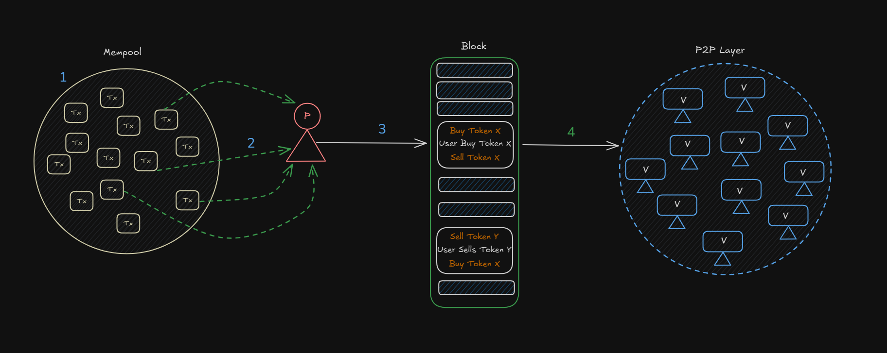
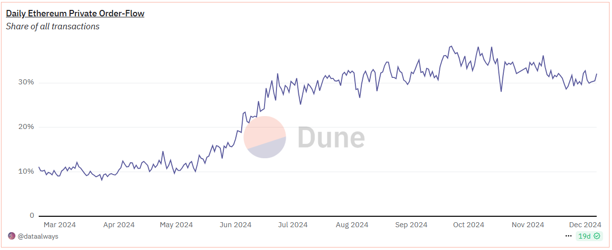
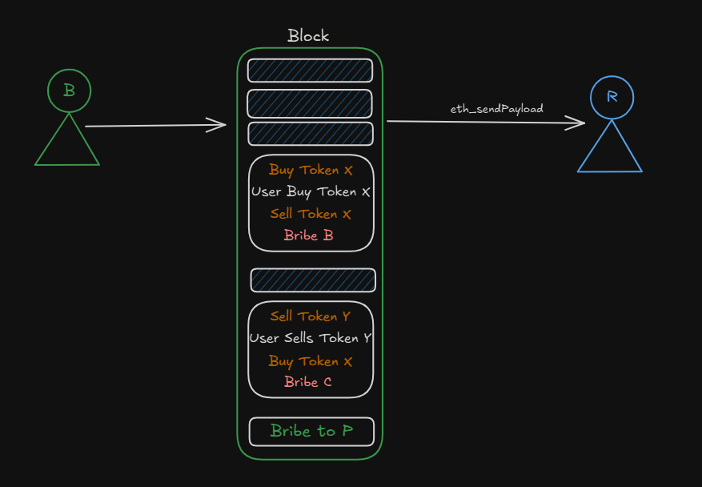
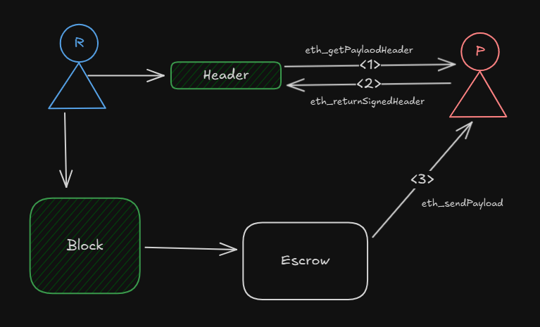
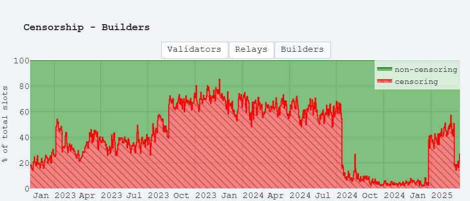

## TLDR

Block Building is a crucial aspect of Ethereum’s lifecycle consisting of various moving part. It determines which transactions get included in a block and in what order, directly impacting network efficiency, decentralization, and fairness. Over time, Ethereum’s block production process has evolved, especially with the growing role of MEV and the shift from validator-driven selection to specialized builders.

This post will discuss how Ethereum Block Building has evolved along with the introduction of Proposer Builder Separation and future research.

Thank you to [@mteam](https://x.com/mteamisloading), [@Gajpower](https://x.com/Gajpower) and [@unnawut](https://x.com/unnawut) for reviewing and providing suggestions. 

## Primer on Ethereum Block Building Components

### **Slots and Epochs**

Ethereum organizes time into discrete units:

- **Slot:** A slot is a 12-second period in which a single block can be proposed. If no validator submits a block within a slot, it is skipped.
- **Epoch:** An epoch consists of 32 slots, totaling **6.4 minutes**.

At the end of each epoch, validator duties are shuffled to ensure decentralization and security. Ethereum achieves economic finality after **2 epochs (~12.8 min)**, after which it is near impossible to revert the blocks.

## **Committees**

Ethereum has a huge number of Validators in the network. At the time of writing, there are 1,051,349 active validators as per [beaconcha.in](https://beaconcha.in/charts/validators) It would be infeasible if this many validators had to verify each block every 12 seconds. Hence, validators are divided into **committees** to efficiently validate transactions and attest to block validity. 

Each committee:

- Consists of a subset of validators randomly assigned at the beginning of an epoch using RANDAO.
- Ensures that no single validator has disproportionate influence.
- Participates in voting (attesting) on blocks and confirming their validity.

The size of a committee depends on the total number of active validators in the network but generally each committee has atleast 128 validators.

In each slot:

- There are lets say `N` Committees assigned per slot and lets say there are `M` Validators in each Committee(where `M` >128). This means there are `NxM` attestations for each slot. As you can understand, it can quickly become overwhelming for the network to gossip this many attestations.
- Aggregators in each Committee are tasked with aggregating the attestations of their respective Committee. This means out of a Committee of `M` Validators. there is only 1 final `Aggregated Attestation` instead of `M`.
- So in each slot, there are a final of `N` Attestations(1 for each committee of that slot) being gossiped to the global topic. The Proposer of the next slot picks up these `N` attestations.

Some points to keep in mind

- During an epoch, every active validator is a member of exactly one committee, so all the epoch's committees are disjoint.
- The protocol adjusts the total number of committees in each epoch according to the number of active validators.
- Current design is to have `64` Committees per slot i.e. `N=64`

### **Proposer Lookahead**

The beacon chain shuffling is designed to provide a minimum of **1 Epoch (32 slots)** lookahead on the validator's upcoming committee assignments for attesting dictated by the shuffling and slot. **Note** that this lookahead does not apply to proposing, which must be checked during the epoch in question.

`get_committee_assignment` can be called at the start of each epoch to get the assignment for the next epoch (`current_epoch + 1`). This also allows validators to calculate the subnet id, join the respective committee and be prepared for their duties.

Additionally, a Validator might be assigned as the `Aggregator` of a specific committee. If so, they must subscribe to the respective topic as well.

## **Proposer Responsibilities**

Within each slot, a **single validator from the respective committee** is selected as the **proposer** to create and submit a block. 

The proposer’s role is crucial as they:

- Construct a block by including pending transactions and attestations.
- Sign and broadcast the `SignedBeaconBlock` to the network.
- Earn rewards for successfully proposing valid blocks.

---

## Short Primer on MEV

MEV is the additional profit extracted by validators (formerly miners) by reordering, including, or censoring the transactions within a block. Some common MEV strategies are:

- **Front-running**: Placing a trade just before a known profitable transaction. Frontrunning is also deemed as toxic MEV since it surprises the user with negative effect.
- **Back-running**: Executing a transaction right after a specific event (e.g., arbitrage bots).
- **Sandwich attacks**: A combination of front-running and back-running, especially in DeFi trades.

### **Who Extracts MEV?**

- **Validators (Pre-PBS)**: When validators controlled block production, they had full discretion over transaction ordering and could directly extract MEV.
- **Searchers**: Independent actors who scan the mempool for MEV opportunities and submit transactions accordingly.
- **Builders (Post-PBS)**: After PBS, block builders take on the role of constructing MEV-optimized blocks, while validators simply select blocks from the highest bidder.

---

## **Block Building Pre-PBS: Validator-Centric MEV**

Before Ethereum’s transition to PBS, the proposer(formerly miners in PoW) had **full control over transaction ordering**. This created an ecosystem where MEV was directly extracted by validators or outsourced to specialized searchers.

### **How It Worked Pre-PBS:**

1. **Transaction Pool**: Transactions are broadcast as usual and enter the mempool.
2. Validators handpicked transactions from the mempool. These could be ordered by something called `priority_fee` which is fees the user is willing to pay to get included first. It could also be ordered in a way the Validator makes more revenue(through sandwich/frontrunning)..
3. The Validator builds the block based using the transactions they picked.
4. **Block Propagation**: The signed block is broadcast to the network.

This is somewhat loosely abstracted to simplify. But this was the general flow. This can be termed as ***Vanilla Block Building***

### **Problems With Pre-PBS Block Building**

- **Centralization of MEV Power**: Large validators had an economic advantage over smaller ones due to their ability to extract MEV more efficiently.
- **Increased Censorship Risk**: Validators could choose to exclude transactions that did not align with their financial incentives.
- **Network Congestion & High Gas Fees**: The bidding wars for MEV transactions led to inefficient block space utilization, increasing costs for regular users.

---

## **Block Building Post-PBS: Separation of Proposers & Builders**

To address the centralization risks and inefficiencies of validator-controlled block construction, **Proposer-Builder Separation (PBS)** was introduced. PBS splits the responsibilities of block production between two separate entities:

1. **Block Builders**: Entities specializing in constructing optimized blocks, often incorporating MEV strategies.
2. **Block Proposers (Validators)**: Validators no longer build blocks themselves; they simply select the most profitable block offered by builders.

### **How It Works Post-PBS:**

1. **Builders Construct Blocks**: Block builders compete to construct the most profitable block, factoring in MEV extraction opportunities.
2. **Bidding for Block Inclusion**: Builders bid to propose their block to validators, ensuring that validators receive the most profitable option.
3. **Validators Select the Highest Bid**: Instead of selecting individual transactions, validators simply choose the highest-bidding builder’s block, maximizing their rewards.

---

# How it works now:

1. User submits transaction via JSON-RPC connected wallet.
2. This transaction is submitted into the public mempool. All transactions are dumped here before they are picked up and validated. Recently, **Private Orderflows** have taken center stage with most big players opting for this since it is workaround to broadcasting your transactions to the public by using permissioned/private channels. Checkout the dashboard on [Dune](https://dune.com/dataalways/private-order-flow) for more insights.

1. **Searchers**  → who are external entities scanning the mempool continuously to find MEV opportunities(**more on this below**). They fetch the respective transactions and insert their own if and when necessary to make a profit. Then, the create a bundle of these transactions, the order of which must be maintained throughout in order for the Searcher to make a profit. Bundles are ordered transactions that must be executed atomically. Along with this bundle, they may add a transaction at the end of the bundle which denotes a “bribe” to the Builder. This bundle is sent to the Builder through the `eth_sendBundle` call.
    
    **Note**: Searchers are external entities and influence transaction ordering but do not participate in block validation or consensus decisions.
    
    

    
2. **Builders** → The next entity is the Builder, who actually builds the block. They try to maximize both the fee revenue as well as MEV revenue. They include the bundled transactions sent by the Searchers(hopefully in order) and accept the payment(bribe) sent by the Searchers. Builders construct execution payloads using received transactions. They fill the blocks with:
    1. Bundles sent by the Searchers.
    2. High priority transactions.
    3. Order general transactions keeping in mind to maximize the revenue. 
    
    They also set the field `feeRecipient` to their own address signifying that they will receive both the Searcher bribes as well as all the fees from the transactions in their submitted block. Builders submit a transaction at the end of their block which serves as a bribe to the proposer similar to what the Searcher did for the Builder.
    
    **Note**: Builders are external entities and do not directly interact with the blockchain. 
    
    
    
    
3. **Relays** → Builder market is a competitive market with various builders wanting to their payloads to get finalized so as to earn the fees. However, most blocks are built by a few well known Block Builders, namely **BeaverBuild** and **Titan.** To simplify this process for the actual Proposer, Relays are intermediary entities who validate the payloads sent by the  various Builders and choose the most one with maximum profit/bid. The Relay-Proposer communication uses a neat trick similar to a Commit and Reveal to ensure the Proposer does not cheat every entity till this point. More [here](#relay-proposer-communication).

# Putting it together

# Relay Proposer Communication

It is entirely possible that on receiving the block payload, the proposer unwraps the block, inserts their own transactions and changes the ordering to their own liking as well as set the `feeRecipient`  to their own address. This would mean every single entity that worked on the block building process till now(Searcher → Builder → Relay) will be cheated or do “MEV stealing”. To prevent this, the Relay sends only the Header of the selected Block Payload. This happens when the proposer make the `eth_getPaylaodHeader` call. The Relay now sends a `PayloadHeader` which contains the hash of the body, the bid, and the signature of the builder. 

The proposer has 2 options at this point:

- To select the `PayloadHeader` (also called *Blinded Block*) provided by the Relay. If so, the proposer must sign the header with their key and send it back to the Relay and consequently request the `PayloadBody` using the `eth_returnSignedHeader` call. Now the Relay executes the `eth_sendPayload` call which returns the entire `ExecutionPayload` to the proposer. The Proposer then simply proposes this block to the Ethereum Validator network or more specifically to the committee they have been assigned to.
- The Proposer may choose not to accept the `PayloadHeader`  sent by the Relay, in which case they must build the block themselves. This includes finding MEV opportunities and ordering transactions accordingly. Of course, in this case the Proposer gets to keep the entire revenue from the fees + MEV. However, this is not as simple as it seems. Finding MEV and optimizing revenue is a fairly computation heavy task and there is the possibility that the proposer may not be able to build the block in time(12 seconds), hence there will be a missed slot. In this scenario, the proposer may be slashed from the network.

## But in Case 1, what if the Proposer does not send the block sent by the Relay?

Well, the proposer is required to sign the `PayloadHeader` for this exact reason. Before sending the Header, the Relay sends the `PayloadBody` to a `Escrow` for safekeeping. Once the Relay receives the signed `PayloadHeader` from the proposer, it verifies the signature and sends the `PayloadBody` stored in the escrow to the Proposer. Now, lets say the proposer does not include this Block. It builds its own block, ignoring the ordering done thus far. In this case, the signature will not match since the headers have changed. 

Something to **Note**:

**It is a slashable offense to sign two different Headers for the same proposing slot.**

The Builder can now broadcast these conflicting Signed Headers to the network and the Proposer may be slashed from the network.

## What is stopping the Builders from censoring transactions?

Well, nothing. The most common reason as to why Builders might censor a transaction is because it interacts with **OFAC addresses**. _To simplify, OFAC address interacting transactions may have legal repercussions, which quite obviously nobody would want on their heads._

According to [Censorship.pics](https://censorship.pics/) blocks built by Builders only include 0-7% OFAC sanctioned transactions.

## How do we solve this?

One of the most well known solutions to transaction censoring as of writing this are `Inclusion Lists`.

[Inclusions Lists](https://eips.ethereum.org/EIPS/eip-7547) are a list of transactions(along with something called Summary) that are posted by the Proposer of the Slot N along with proposing the Block of Slot N. 

Inclusion Lists enforce that the transactions in the list must be included either in Block N or Block N+1, otherwise the N+1 block will be invalid. This is called ***Forward Inclusion Lists.*** 

**Note**: There is also a notion for ***Spot Inclusion Lists*** which does IL for the current Block N itself. But this design had economic flaws leading to ***Forward Inclusion Lists.***

Of course, this design of ILs will not enable 100% Censorship Resistance, but there is active research ongoing to harden these proposals and many neat optimizations that can be applied to better the incentive structure.

### FOCIL

[Fork Choice enforced Inclusion Lists (FOCIL)](https://ethresear.ch/t/fork-choice-enforced-inclusion-lists-focil-a-simple-committee-based-inclusion-list-proposal/19870) is a new design proposed in 2024 which builds and improves on Inclusion Lists to increase credible neutrality.

FOCIL allows multiple Validators to provide suggestions on the Inclusion List for a specific slot. To be more precise, 16 Validators are chosen randomly at each slot to form an Inclusion List Committee. These members each form their own local IL and gossip it around to the network. The Proposer collects and aggregates available local inclusion lists into a final IL. The IL designs are lightweight since there is no need to rebuild the block to include these transactions; they can just be appended to the block. The condition for a Block to satisfy the IL validation requirement is **“*Block is valid if it contains all the transactions from all the ILs until the block is full”***

**Note**: The IL committee members cannot guarantee any form of transaction ordering as the IL transactions can be included in any order. They only guarantee transaction inclusion.

## **Benefits of PBS for MEV Management**

- **Decentralization of MEV Extraction**: Block builders, rather than a few large validators, handle MEV extraction, reducing validator centralization risks. However, this is a double edged sword since in the process of mitigating Validator centralization, we have introduced Builder Centralization where only a few Builders are building a large percentage of Blocks.
- **Fairer Revenue Distribution**: Validators still profit from MEV without directly engaging in extraction, making block production fairer.
- **More Efficient Block Space Utilization**: Competition among builders leads to optimized blocks with better gas efficiency.

### **Challenges of PBS**

- **Centralization Risk Among Builders**: While validators are decentralized, a few dominant builders could still centralize MEV extraction.
- **Trust in Off-Chain MEV Relays**: PBS currently relies on MEV-Boost relays, which operate off-chain, posing potential security risks as a point of failure.

---

## References:

[**Ethereum's Proposer-Builder Separation: Promises and Realities**](https://arxiv.org/abs/2305.19037)

[State of research: censorship resistance under PBS](https://notes.ethereum.org/@vbuterin/pbs_censorship_resistance)

[**Builder Censorship: ethereum's rotten core**](https://mteam.space/posts/builder-censorship--ethereums-rotten-core/)

[EPF Wiki - PBS](https://epf.wiki/#/wiki/research/PBS/pbs)

[**Notes on PBS**](https://barnabe.substack.com/p/pbs)

[**Forward inclusion list**](https://notes.ethereum.org/@fradamt/forward-inclusion-lists)

[Who Wins Ethereum Block Building Auctions and Why?](https://arxiv.org/pdf/2407.13931)

[FOCIL](https://eips.ethereum.org/EIPS/eip-7805)
